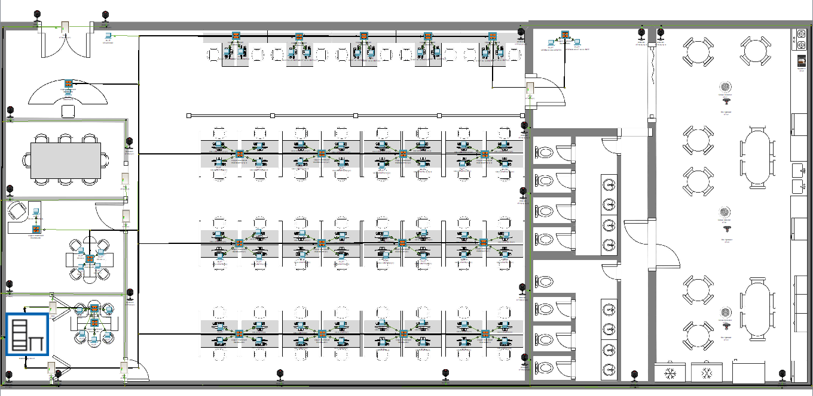

# Ecommerce Network Project

This project involves designing and implementing a network for an ecommerce platform using Cisco Packet Tracer. The network aims to provide secure, scalable, and efficient communication for the various components of the ecommerce infrastructure.
